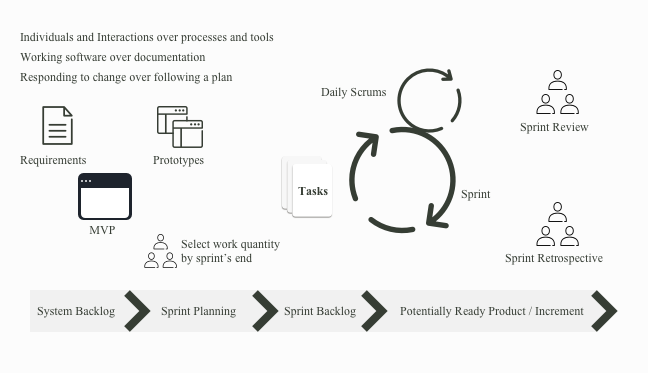

## Agile Architecture and Approach
U.Group’s delivery approach is grounded in the principles of agile delivery, placing the problem statement and challenges of the end user at the center of everything that we do. With a human-first approach, our delivery practice is rooted in customer satisfaction, ease-of-use and comprehension, and the enhancement of business and engineering capabilities. This focus on continuous improvement drives us to leverage strong engineering fundamentals to produce high quality, highly reliable, scalable, and secure solutions. Leveraging the best in open source software, we deliver business value quickly, efficiently, and securely.    

As an experience and data-driven organization, we understand the importance of high quality products and consistent data while preserving the security of our customers and the data that we protect. Our significant work within the Department of Defense (DoD) managing large quantities of data at scale has provided us with extensive experience and appreciation of the importance of using strong security measures including encryption, secure distributed technologies, while building cloud centric and cloud native solutions. Our delivery process stresses the need for active collaboration with our clients to deliver value early and often while leveraging agile methodologies and CICD techniques.

## Agile Process
U.Group’s agile and lean processes, as well as our versatile team enable successful outcomes by first asking the right questions, getting the involvement of users, and understanding their workflows and pain-points. With situational awareness of the current technical, operational, and cultural environments, we create solutions in collaboration with client and partner stakeholders.   

At the onset of the challenge, the team spent time dissecting and understanding the core issues and concerns provided within the challenge. This was used to outline our strategy and aid in rapid prioritization, leveraging the core user stories as the basis of success. Our approach reflects the evolution of business value while migrating between backlog to a production state.

U.Group's philosophy:
- A shared understanding of the goals and project status among all team members is vital for delivery success
- Aim to constantly deliver of thin vertical slices of functionality
- Experiment relentlessly to fail early, recover quickly, and adjust as needed
- Foster Collaboration through active collaboration either through physical colocation or investment in virtual collaboration tools

## Technical Development Approach
U.Group’s team uses Test Driven Development (TDD) and active code review techniques such as pair programming as fundamental building blocks of our delivery process. During the challenge, we actively paired to continually evolve the asset over time to ensure high quality and consistency in the vision. This is reflected in the git history through our practice of git flow to ensure pull and merge requests were compliant with best practices, standards, and our overarching technical design.

__Active Code Review__
Using paired programming methods, we enabled continuous review of the software while leveraging git flow as our source code management process. This approach also allowed team members to think together in a highly collaborative environment. We set rules for reviews at project start and implemented a rapid feedback loop to minimize disruptions and maximize productivity.   

Code Review Rules:
- Leverage automation where possible to provide immediate feedback
- Enhance the Continuous Integration and Delivery process to compliment our delivery methodology and report metrics over time
- Conduct retrospectives to understand opportunities in both ways of working and evolution within the code base

## Project Team
After evaluating the problem we then designed a fit for purpose cross functional team with the following personnel:
- Data Scientists
- Developers
- UX Designers
- DevOps Engineers
- Site Reliability & DevSecOps Engineers
- Product Owners

We grouped our people into several teams:
- Decomposing the problem into levels of criticality and complexity
- People working on content management and encryption
- Another one on data science research and exploration
- Overarching architecture
- User experience and product development

## Engineering Focused Delivery
For this process U.Group conducted various levels of testing complemented by concourse CI for continuous integration which allowed us to have quick and meaningful feedback, while visualizing a pipeline as a value stream. We selected concourse because of the inherent complexity of managing systems that have multiple dependencies that may have various life cycles. Additionally, we wanted to manage the CloudHSM as part of our ecosystem which also created a more holistic perspective of our individual environments allowing for automated scaling and provisioning using tools like Terraform.   

U.Group wrote unit test cases before beginning development, and used Concourse Continuous Integration Server for each commit to extract tests from Github and execute them for quality checks. Our process for Test Driven Development (TDD) included:
- Write unit test case describing the criteria of the program
- Execute the test to verify failure
- Write code (minimal) to pass the test
- Refactor the code to confirm with acceptance criteria

__Tools__
U.Group used Jira and Slack to manage tickets and coordinate within the team. Using Slack we captured build, deployment, and monitoring alerts along with pull and merge requests. Additionally, our team used Jira to capture user stories, create backlog, assign stories to sprint, and capture burn down process.

## Decisions
During the course of the challenge, U.Group made numerous decisions on technology, architecture, design, boundaries of MVP, user story prioritization, and innovations that can be implemented in the challenge. Our team used lean decision making processes empowering our team to quickly iterate and make decisions. Below are some of the decisions we made as a team during the coding challenge process:
1. Daily sprints: helped us slice user stories thinly and ensured a deliverable product at the end of every working day with time for all expected agile ceremonies.
2. Primary use of open source products: specifically within the security and data persistence and user experience tiers to accelerate development and reuse well-known human centred design paradigms.
3. Designing for cloud-centricity: including high availability, fault tolerance and transaction transparency as a core tenant within the ecosystem. This allows for scalability and end to end transaction unifiction leveraging Elasticsearch Logstash and Kibana (ELK Stack) as our telemetry platform of choice.
4. Leveraging industry standards of data classification, such as the CIA data classification of data at rest, data in use and data in transit to secure content in a decentralized multi-key and multi-dimensional encryption processes.

## Progress
To ensure a successful delivery, U.Group scaled our execution into the following milestones:
- Firstly, for initial milestone, we focused on data discovery and research. Gathering insights into available data sources and types.
- Second, using one specific data source, we went end to end including ingestion, secure and save. This allowed us to really focus in and learn more about the problem space and how end users would eventually use the system.
- Third, we built search functionality with data driven dimensional analysis- enhanced multidimensional (fuzzy) search.
- Fourth, we used any available data to provide intelligent data categorization and entity extraction. We felt that this feature was essential for the end users to help shift the user experience away from search towards discovery.

Each of these stages delivered working software through our continuous delivery pipeline. Initial MVP focused on data consolidation and persistence leveraging the open movie database as our initial data source in addition to publicly available social data. This generated the initial dossier while leveraging cryptographic erasure.
