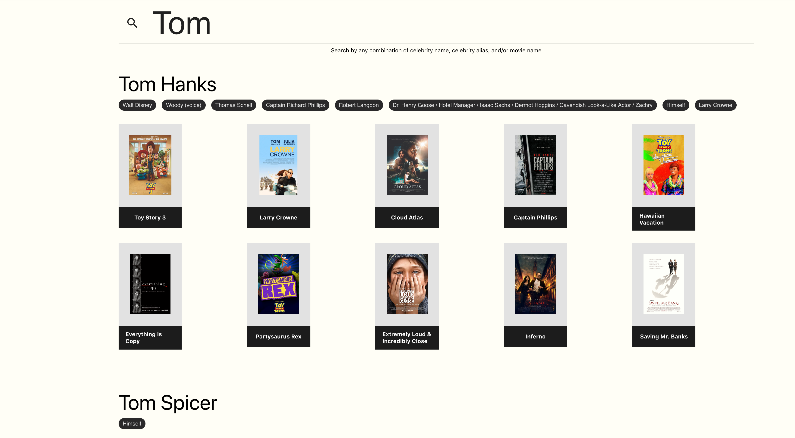
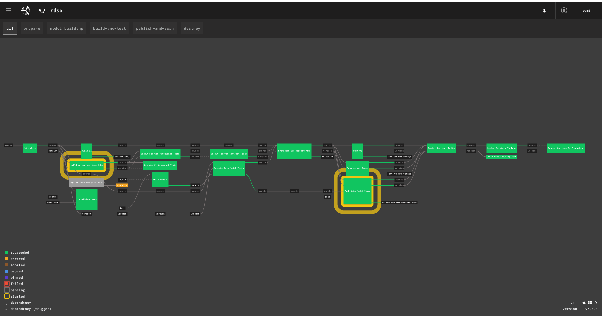
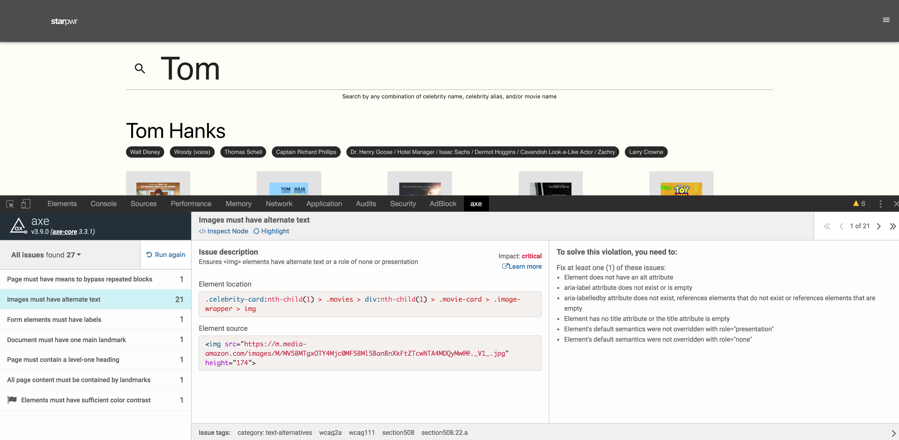
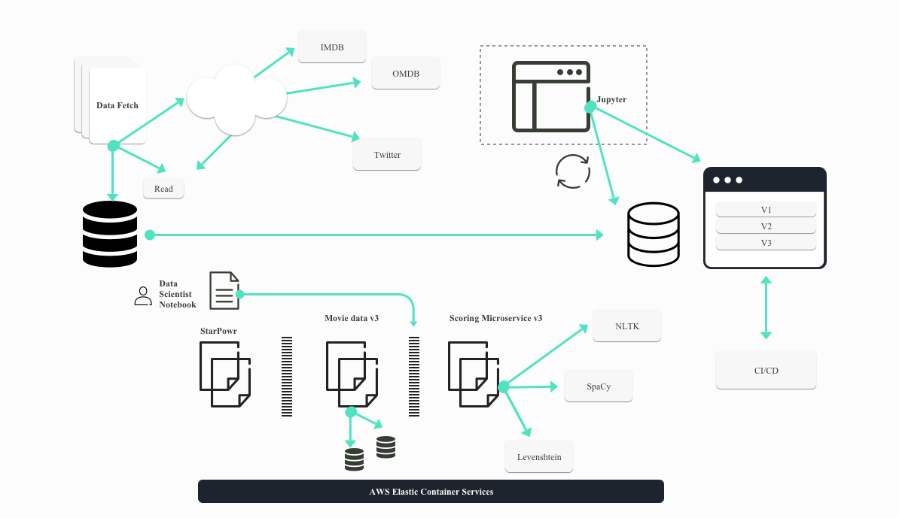

<!--  -->
## Documentation



All documents for this submission can be found in the [docs](docs) folder
## ASSUMPTIONS AND PREREQUISITES

We assume that the developer machines used for this project will be pre-configured with the following tools:

|   | **Clone** | **Build** | **Deploy** |
| --- | --- | --- | --- |
| **Git (for Mac)** | **X** | **X** | **X** |
| **Git-Bash (for Windows)** | **X** | **X** | **X** |
| **JAVA (version 12 or greater)** |   | **X** |   |
| **Maven (v.3.6.1)** |   | **X** |   |
| **Python (v.3.6)** |   | **X** |   |
| **Terraform (v.0.11.13)** |   | **X** |   |
| **Docker (v.18.09.2)** |   | **X** | **X** |
| **Node.js (v10.16.0)** |   | **X** |   |
| **NPM (v.6.9.0)** |   | **X** |   |
| **AWS Account** |  | **X** | **X** |


__Note: Instructions for installing these tools and configuring the dev environment can be found in the “Help for Prerequisites” section of the [Solutions.PDF](docs/Solution.pdf) document located in the main folder of the GitHub repo.__


|   Component              | Url                               |
|---                       |                            ---    |
|   StrPwr - Prod          |   https://www-lb-98250145.us-east-2.elb.amazonaws.com |

## User Defaults
__Business User__

* Username - business-user
* Password - password

__Business Supervisor__
* Username - business-supervisor
* Password - password


__INSTRUCTIONS FOR DEPLOYING SOLUTION IN AWS ACCOUNT__


To build the CI/CD pipeline and automatically build the infrastructure and environment, we have provided a one-step script:

## Option 1 - (Docker)
* Open a terminal and navigate to the extracted directory `ugroup-records-submission`
Run the script

docker build -t rdso/builder .
docker run -it -e "GIT_USERNAME=<git_hub_user>" -e "GIT_PASSWORD=<git_hub_password>"  -e "AWS_ACCESS_KEY_ID=<aws_access_key_id>" -e "AWS_SECRET_ACCESS_KEY=<aws_secret-access_key>" rdso/builder

## Option 2 - (Native - MacOS)

Install the following tools

[Concourse](https://github.com/EngineerBetter/control-tower/releases/tag/0.7.3)


AWS_ACCESS_KEY_ID=<access-key-id> \
AWS_SECRET_ACCESS_KEY=<secret-access-key> \
control-tower deploy --iaas aws <rdso>

Once completed,

* Replace the <> characters in the above command with the appropriate values. As we do not allow authentication information into version control, please leverage the account information that was provided as part of the code submission for GitHub access.

* The command gets executed for about 35 minutes and the output is a URL that will be presented to the user at the end of execution. This is the Concourse CI URL. Use the URL and the Github credentials provided to log into Concourse CI. When you log in, you will see a build job getting executed. This job will run the build and deploy jobs for the development, end to end testing and production environments. The entire process takes around 30 minutes to complete.

_Note that after deployment and upon startup each environment will begin progressively building up the data used by the application. Over time more Dossiers and actors will be built up and loaded by the system, and the existing entries will become more
rich enriched.

For example, as more movies are processed, the list of similar movies within a given dossier can grow. Similarly, as more movies are processed, the list of movies associated with a given actor can grow if more are encountered.
The application takes about 3 to 5 minutes to start up initially.

* The development environment will be deployed automatically. In order to ensure the deployment of the end-to-end testing and prod environments, follow the below remaining steps:

* Once the deployment job for given environment is completes (goes from yellow to green), click on the next phase in the concourse pipeline to begin that phase (end-to-end testing or prod).
Click on the “+” sign for the deploy job for a given environment to deploy it to that environment.
Once each stage turns green, click on that stage and then expand the Terraform section to see the URLS at the bottom of the output for that job. To that, go to the job, click on "Write Variables and Run TF Deploy",
and then scroll to the bottom of the output.

* www-url of each stage is where the web end of that stage is deployed.

* Notebook URL of each stage is where the notebook is generated. To log on to notebook, enter the notebook URL into browser and use Github password provided to log into it.

### Troubleshooting
_If the concourse job fails because of “too many concurrent requests or resource not found” errors, restart the job. This is an error caused by race condition in the underlying software (Concourse)._

_If concourse stalls or fails with a “worker stalled” error, it essentially means that the AWS account has limits on the account and was unable to provide workers to Concourse. The best course of action at that point is to restart the process with a fresh AWS account._

__NOTE: This command will also build a docker container that can be used to orchestrate the provisioning of the Continuous Integration environment. This tool will leverage scripts present in our git repository for transparency and audit.__

__LOCAL DEVELOPMENT__   
Developers on our team use tools including `docker-compose` and `jupyter` to explore the data and develop our applications. To start these environments, navigate to the root of the `ugroup-records-submission` repository and run the following command:
```
export AWS_ACCESS_KEY_ID='<>';export AWS_SECRET_ACCESS_KEY='<>';./run-all.sh
```   
Fill in AWS access keys and secret access keys for the '<>' characters.

If you wish to walk through our process in a self-contained notebook environment, you may run the following command from anywhere on your terminal where `docker` is supported:
```
docker run -p 8888:8888 ugroup/data-science-notebook
```
The notebook environment will be available in a browser at `http://localhost:8888` and will require the use of a token generated by the process after a download is complete. Inside the notebook environment will be a file called `AI/`

If you would prefer to build the image downloaded by this step yourself, navigate to the `ugroup-records-submission/services/data-science-service` and run the following commands, filling in your AWS credentials as discussed above:   
```
docker build -t evaluation-image .
docker run -it -p 8888:8888 \
    --build-args AWS_ACCESS_KEY_ID='<>' \
    --build-args AWS_SECRET_ACCESS_KEY='<>' \
    evaluation-image
```

## SOLUTION DESCRIPTION
__High Level Project Overview__

We have included a series of scripts to accelerate delivery and development as follows:

* `build-all.sh && docker-compose up` - This will allow a user to run the entire platform locally. This is aimed at providing quick developer feedback and will provision an instance of the entire platform on your local machine. Note on launch, the environment will load all tickers and rate each company so initial start up will take a few minutes.

* Within `services/data-science-service` there are utilities for creating new training sets that will generate a new set of training data. This process is time consuming as it will query the following data sources:
  * __Movietweetings__ - A list of the films that represented ground truth, as well as a record of microblogging messages from Twitter users who rated films released after 2009
  * __IMDB__ - 10 years of data on on the film details, actors, and characters identified in movies between June 2009 and June 2019 obtained from a public data dump by the site
  * __OMDB__ - Supplemental data describing the plots and keywords used by our model training

That scraping is done by python programs to complete work. You can execute those programs by going into the pipeline and running the `Capture data and push to s3` job there. This will start the collection of a training data set and place it in S3.

__Business Use Cases__

###### Business User
Our initial user is a SPIDER investigator who needs to review the plot details, and actors (or the names of their characters) that correspond to a film dossier. This user would like to understand at a glance what people are saying about the film, what other similar films are, and use that as a launching point to investigate the celebrities who act in the film. The assignment for the business user today is ***Toy Story 3***.
- The user should be able to locate the dossier for Toy Story using a search bar.
- When the user finds the dossier, the user should also be able to see the actors that star in the film.
- From the initial Toy Story 3 dossier, the user should be able to navigate to the page for ***Tom Hanks*** without additional searching.
- The user should be able to see information from multiple data sources and scroll through all of the information detail.


###### Business Supervisor
For our use case, a SPIDER business supervisor should be able to navigate first to the page of a celebrity and use it to conduct a new investigation of a movie. The business supervisor has a celebrity in mind, but can only remember the name of the character, so she initiates a search with ***Iron Man***.    

- The business supervisor should be able to navigate to the page of the actor who plays Buzz Lightyear and see what other films he has starred in.
- The business supervisor should be able to make a note on the page for one of the actors she finds suspicious.
- The business supervisor would like to insert a PDF with some valuable information for a business user who may look at a dossier later.
- After considering one of the film dossiers, the business supervisor realizes that the dossier should no longer be able to be shown in the data, and decides to delete it.
- The business supervisor searches for the dossier she just deleted, to ensure that it can no longer be used by business users.

###### Business Report Generation
Another business user needs to generate a report given the data he found in the dossier. He wants to collect a list of films that fit together, and present their dossiers, as well as all collected information such as notes from other business users.
- The user should be able to make note of the most similar other films, and other films that have been identified using similar terms in the plot summary for the film.
- The business user notices that some of the names in the Plot Summary section of one of the films might be sensitive for a report, so she would like to be able to quickly identify the names of people, organizations, and countries that occur in them using the Auto Redact tool.
- The identified dossier data should be saved in a secure persistent data source on AWS for archival, audit, and reference.


### Repository Hierarchy List
| PACKAGE | PURPOSE |
| --- | --- |
| /config | Contains all scripts required for configuration management. This is used for provisioning the environment on AWS. All scripts leverage terraform |
| /docs | Contains technical documentation for the project. For functional documentation we have included a series of Unit, Integration, Functional, and Contract Tests. This folder also includes the Solution.PDF, commits.PDF, UserStories.PDF documents. |
| /models | Contains the models.md file. |
| /services/data-science-service | Contains AI/ML services that analyze the data using Natural Language Processing
| /services/hsmgateway | Location for HSM Gateway configuration and application deployment using Docker
| /tools | Contains the tools and utilities used for quick and easy configuration of the dev environment. |
| /ui | Contains the front-end configuration for the UI that is deployed for a Product Owner and access of the data services. |
| /ui/frontend | This is the ReactJS based frontend application that is used for exploring dossiers
| /ui/server | A Spring Boot Microservice that is implemented as a BFF (Backend for Frontend) Layer to mediate services calls between Elastic Search (our optimized persistence tier) and the Data Science Microservice. |
| .gitignore | A file that tells Git which files to not track. |
| ReadME.md | The ReadME.md file. |
| build-all.sh | Builds the docker containers locally – used for dev only. |
| build-ds.sh | Builds the docker containers for data science servces locally – used for dev only. |
| run-all.sh | Runs all of the services locally – used for dev only. **Note: this is the only way that services should be run locally.** That is because a timestamp is created in run-all.sh, and that timestamp is used as part of the bucket name for a bucket created by the UI server. Bucket names must be globally unique, and so the first line of run-all.sh accomplishes that.
| docker-compose.yml | Local dev file to orchestrate local dev environment.  Also used in contract tests. |
| generate-project.sh | Initial microservice and configuration scaffolding. |
| pipeline.yml | A descriptor used to evaluate and control the entire project pipeline. |
| pom.xml | A descriptor of the project as a maven module. |
| Scans.md | The Scans.md file. |
| wait-for-status-code-at-url.sh | A shell script for waiting for a status code via a cURL commands and in a loop. |


### Pipeline



Concourse was used to build our end to end, fully automated pipeline and can be accessed (including build history) .

Within the CI/CD pipeline, code flows from Left to right with the left most step being used to aggregate all the required changes and kick off various build stages.

Each stage is represented as a series of dependencies and outputs which then build our promotion process. Concourse CI provides rapid delivery and enables automation to be accomplished with compliance during the delivery process. Our pipeline includes several features that provide zero-downtime deployments in a high availability configuration:

__Data Science Model Training and Engineering within the Pipeline:__
`Build Training Set -> Process and Prepare Data for Training -> Train Model -> Promote Model Binary -> Containerize Model Service`

__Data Integration:__
`Build Data Transformations -> Contract Specification & Documentation -> Micro Service Containerization`

__User Experience__
`Build Components -> Build UX Containers`

### Continuous Testing



As we are deploying multiple components (Batch Processes for training, Micro Services for integration and Micro Services for Data Science capabilities) we also provide Consumer Driven Contract Tests. This strategy allows our developers and data scientists to communicate their intent via code in a testable and documented fashion within the pipeline. These consumer driven tests become a statement of expectations that will reflect how integration can be done in production. Each of the pipeline features are automatically tested through the pipeline, including:

* Unit
* Integration
* Accessibility
* Security (OWASP - In the Pipeline )
* Contract (Necessary to ensure model integration)
* Experience Responsiveness
* Static Code Analysis (SonarQube)

In addition, we include functional tests that can be run against any of the 4 environments that we support: local, dev, test (end to end testing), and prod
### URLs and Work Products
__Note: the URLs are available within the deployment steps of their respective environments (dev, test, prod).__

## SOLUTION DESCRIPTION

Our solution is comprised of the following components, which are explained in detail in the solutions.pdf document.

* Data Collection & Data Processing Laboratory
* Model Training and Deployment
* Data Engineering and Model Optimizations
* Data Streaming & Persistence
* User Experience and Data Visualizations. The UX mockups for our solution can be accessed [here](https://projects.invisionapp.com/prototype/rdso-workspace-cjzd929e50001wz01msyqqrjj).
* Security for Data in Various Modes (i.e., at rest, in transit, and in use)

Our solution makes use of AWS through a fully automated CI/CD pipeline orchestrated with Terraform as a configuration management tool.  Our selection of AWS and Terraform was driven by the ability to create environments seamlessly without being coupled to a given deployment target as well as the familiarity of these tools within USCIS.  As we are provisioning Docker Containers, we also have the ability to seamlessly provision workloads within the cloud and have AWS’ Platform as a Service implementation (Elastic Container Service) handle our process scheduling.


__Stability:__ To ensure Stability:
Our platform leverages cloud optimized Platform as a Service (PaaS) techniques and built in telemetry support for the container platform.

__Security:__  Our application leverages AWS provided security implementations, along with Role-Based Access Controls.

__Maintainability:__ We utilized 3 core principles for maintainability:
* Simplicity- Dividing the architecture into distinct components so that new developers and data scientists can easily get acclimated to the system.

* Reliability – All services, including models, provide a series of channels of telemetry to CloudWatch which can be used to get insight into transactions that are in flight. Additionally, that telemetry is used to measure model performance over time, giving visibility into how the accuracy of our models is increasing overtime. Data on model performance over time can then be used to build AI/ML trust from the perspective of the system's stakeholders.

* Extensibility – Modular design that easy enough to adjust to evolving needs and technology.

__Scalability:__  To ensure scalability, we have containerized all aspects of our solution and deploy them as independently scalable components with high availability requirements in two different availability zones. This along with Elastic Load Balancers, provides an unparalleled level of scalability and redundancy within the platform

## HIERARCHY LIST OF CORE TECHNOLOGIES

* SpringBoot
* ElasticSearch
* Kibana
* S3
* AWS CloudHSM
* Spring Security
* Terraform
* Spacy
* gensim
* ECS
* ReactJS
* Junit
* jest
* Pytest
* Concourse
* SonarQube
* Pa11y


## High Level architecture


